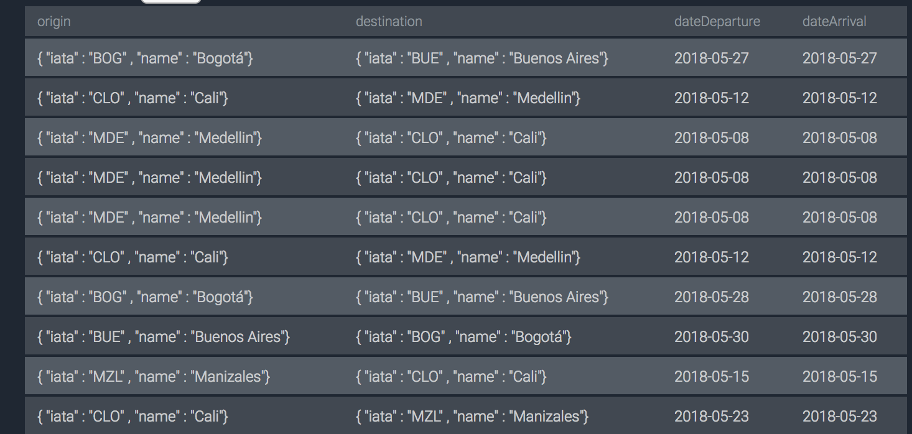
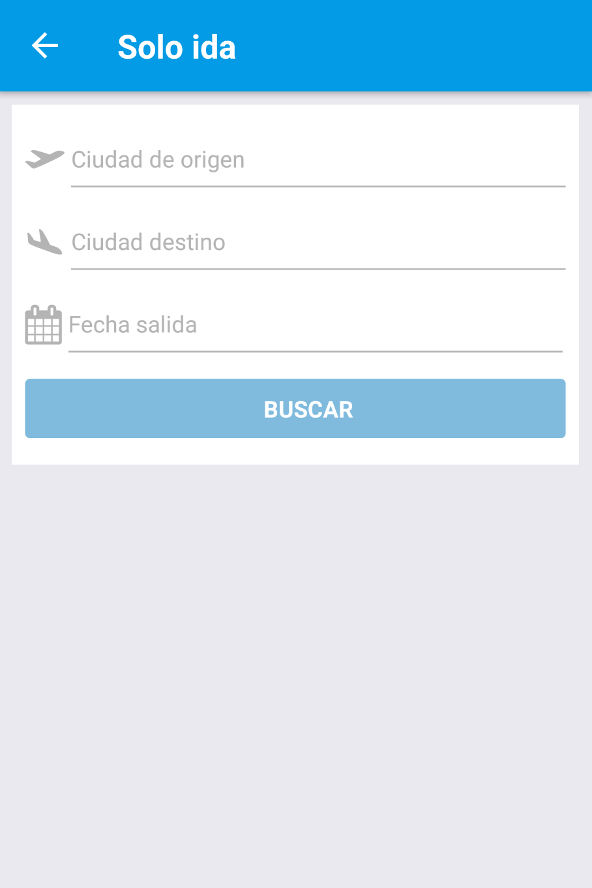
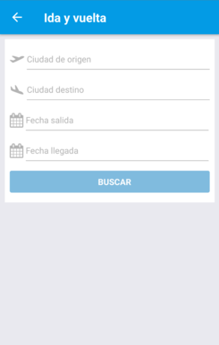
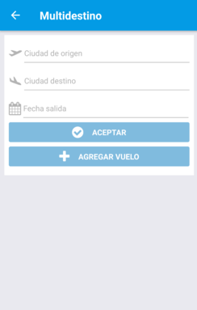

# Almundo
Aplicación final del semillero de Almundo. La aplicación se realizó en React Native y Typescript.
El usuario en la aplicación va a poder listar los vuelos dependiendo del tipo de consulta que quiera realizar y poder ver el detalle de cada vuelo.

## Pre-requisitos

Para correr el proyecto se debe tener instalado principalmente:
1. [NodeJs](https://nodejs.org/es/download/)
2. React Native (`npm install -g react-native-cli`)
3. Emulador de android.

## Instalación

1. Clonar el proyecto digitando el siguiente comando en la consola: 

```
git clone https://github.com/johe8809/almundo-app.git
```
2. Ejecutar el siguiente comando para instalar los paquetes que se encuentran en el package.json

```
npm install
```
3. Abrir el archivo que se encuentra en la ruta: `/src/Api/index.ts` y cambiar la ip por la del equipo donde este corriendo el proyecto de la API REST

4. Iniciar el emulador

5. Luego ejecutar el siguiente comando por consola:

```
npm run watch
```
6. Luego ejecutar el siguiente comando en otra consola para arrancar la aplicación:

```
react-native run-android
```

7. Listado de vuelos para probar en la aplicación


## Capturas

1. 
2. 
3. 
4. 

## Desarrollador
Yonnathan Henao
